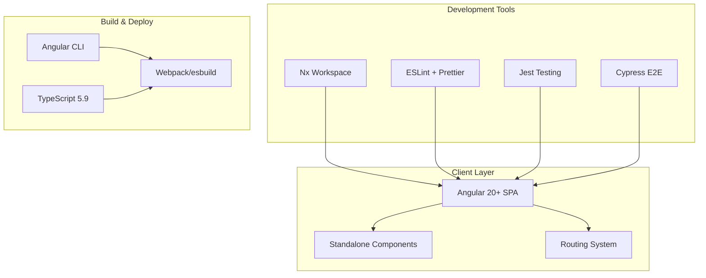
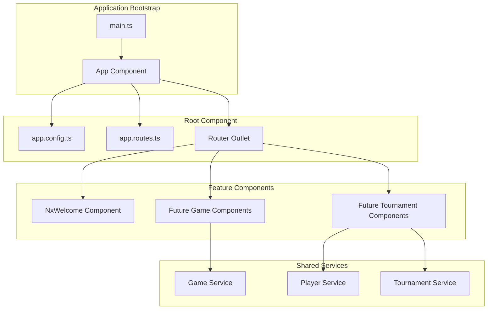
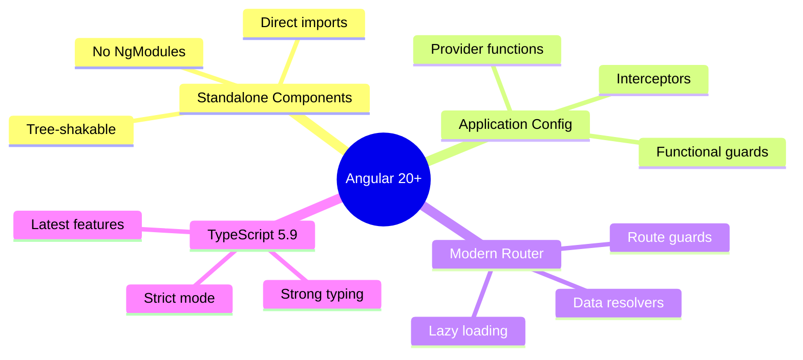
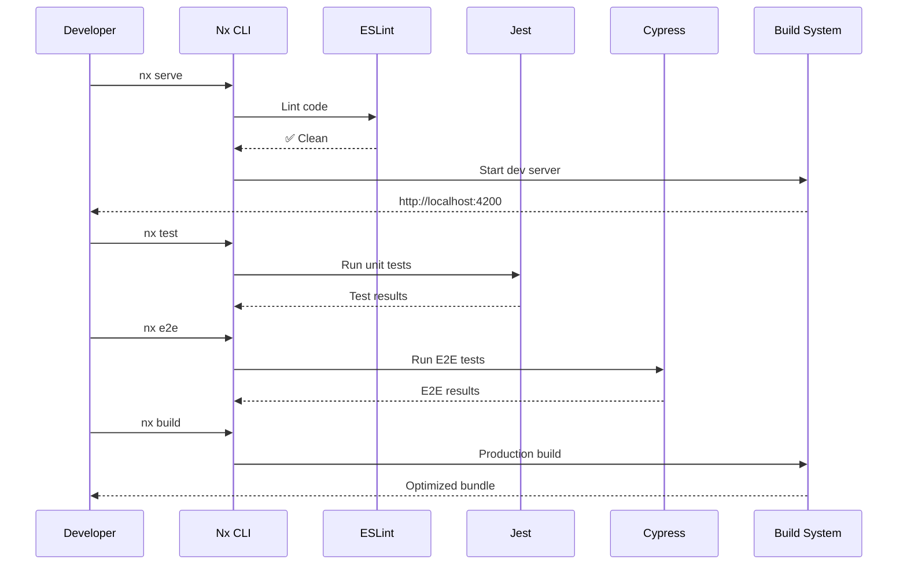
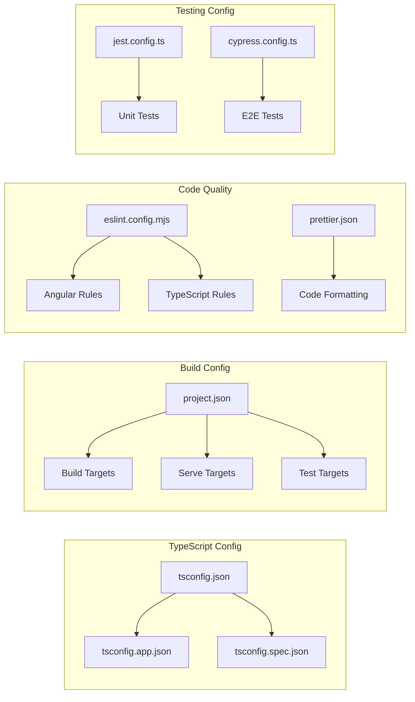
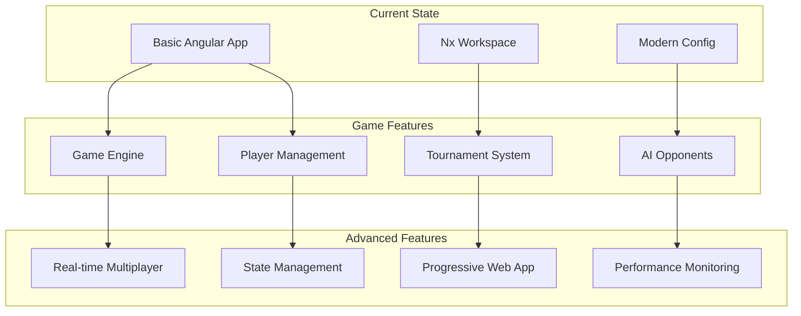
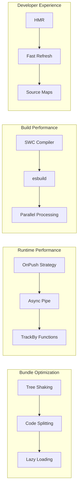
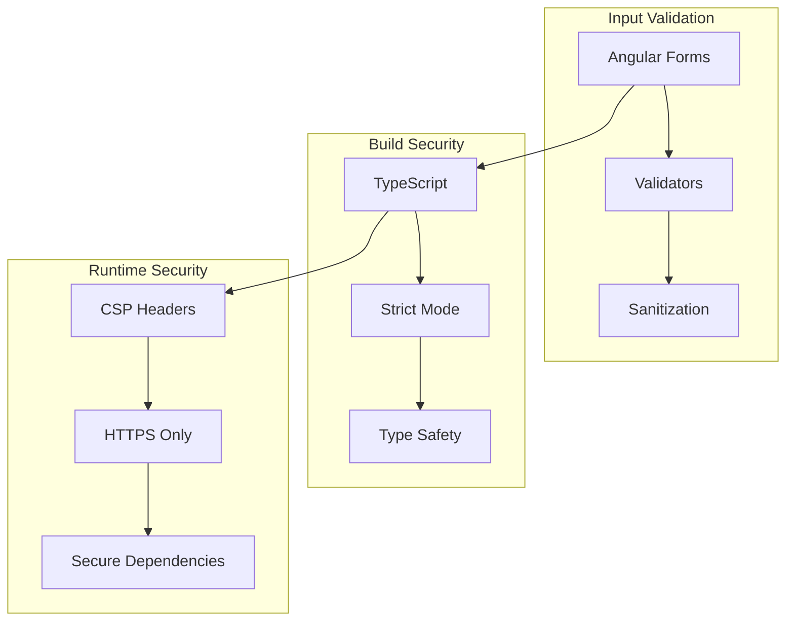

# Jouster Application Architecture

## Overview
Jouster is a modern Angular 20+ application built with Nx monorepo tooling, implementing a standalone component architecture with modern best practices.

## High-Level Architecture



## Application Structure

```
Jouster/
├── src/
│   ├── app/
│   │   ├── app.ts              # Root standalone component
│   │   ├── app.config.ts       # Application configuration
│   │   ├── app.routes.ts       # Route definitions
│   │   ├── app.html            # Root template
│   │   ├── app.scss            # Root styles
│   │   └── nx-welcome.ts       # Welcome component
│   ├── main.ts                 # Bootstrap entry point
│   ├── index.html              # HTML shell
│   └── styles.scss             # Global styles
├── nx.json                     # Nx workspace config
├── project.json                # Project configuration
├── tsconfig.json               # TypeScript config
├── eslint.config.mjs           # ESLint configuration
└── package.json                # Dependencies & scripts
```

## Component Architecture



## Modern Angular Features Used



## Development Workflow



## Configuration Architecture



## Dependency Architecture

```mermaid
graph TB
    subgraph "Runtime Dependencies"
        A[@angular/core 20.3.0]
        B[@angular/common]
        C[@angular/router]
        D[rxjs 7.8.0]
        E[zone.js 0.15.0]
    end
    
    subgraph "Development Tools"
        F[@nx/* 21.6.2]
        G[TypeScript 5.9.2]
        H[ESLint 9.8.0]
        I[Jest 29.7.0]
        J[Cypress 14.2.1]
    end
    
    subgraph "Build Tools"
        K[@angular/cli 20.3.0]
        L[@angular/build]
        M[@swc/core 1.5.7]
    end
    
    A --> D
    A --> E
    F --> G
    F --> H
    K --> L
    L --> M
```

## Future Architecture Extensions



## Performance Considerations



## Security Architecture



## Key Architectural Decisions

1. **Standalone Components**: Eliminates NgModules for better tree-shaking and simpler architecture
2. **Nx Monorepo**: Provides scalable development tools and build optimization
3. **Modern TypeScript**: Leverages latest language features for better developer experience
4. **Functional Configuration**: Uses provider functions instead of classes for better performance
5. **ESLint Flat Config**: Modern linting configuration for better maintainability

## Best Practices Implemented

- ✅ Standalone component architecture
- ✅ Modern Angular 20+ features
- ✅ TypeScript strict mode
- ✅ Comprehensive linting rules
- ✅ Unit and E2E testing setup
- ✅ Modern build tools (SWC, esbuild)
- ✅ Code formatting with Prettier
- ✅ Git hooks and commit linting
- ✅ Performance optimizations

---

*Generated on: October 3, 2025*
*Angular Version: 20.3.0*
*Nx Version: 21.6.2*
